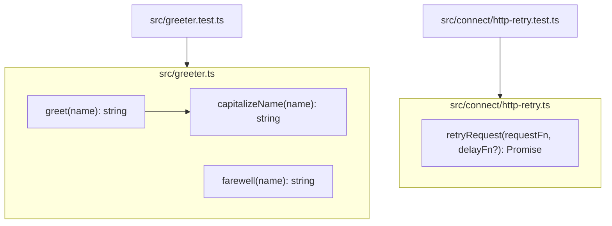

Per `README.md` and [[overview]] (`knowledge/overview.md`), this repo is a seeded testbed for a resolver+ingestion test matrix, not a running application. The working tree's source now spans two independent modules with no imports between them: `src/greeter.ts` (+ `src/greeter.test.ts`) and `src/connect/http-retry.ts` (+ `src/connect/http-retry.test.ts`). There is still no `package.json`, no build config, no entrypoint, no server process, and no `frontend/` source (only `frontend/AGENTS.md`, a guidance doc with no code alongside it) — so there are no wired-together services or multi-module architecture to diagram; each module is a standalone script exercised only by its own test file.

`greet` delegates to the extracted `capitalizeName` helper (both verb-first, per the naming rule in [[ingested-agents]] AGENTS.md). `retryRequest` wraps a request function with fixed-attempt (3x) exponential backoff for transient failures (thrown errors or 5xx responses), taking an injectable `delayFn` seam so tests can skip real timers.

## Divergences

Diverges from CLAUDE.md: the "Architecture" section describes Dapr pub/sub, PostgreSQL, a GraphQL gateway, and Kubernetes (AKS) deployment → none of that infrastructure exists in this working tree (no `nx.json`, no service directories, no Dockerfiles or k8s manifests, no dependency manifests of any kind). This mirrors the broader divergence already recorded in [[overview]].
