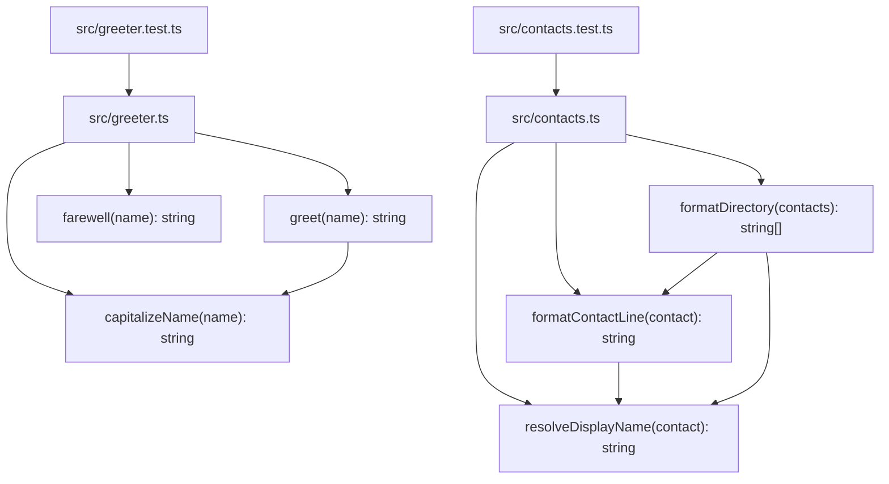

Per `README.md` and [[overview]] (`knowledge/overview.md`), this repo is a seeded testbed for a resolver+ingestion test matrix, not a running application. The working tree's source is now two independent files under `src/`: `src/greeter.ts` (with `src/greeter.test.ts`) and `src/contacts.ts` (with `src/contacts.test.ts`). Neither file imports the other — there is no cross-module dependency, just two sibling script modules sharing the same JSDoc/test conventions. There is still no `package.json`, no build config, no entrypoint, no server process, and no `frontend/` source (only `frontend/AGENTS.md`, a guidance doc with no code alongside it) — so there are no services, processes, or multi-module architecture to diagram beyond these two flat modules.

`greet` delegates to the extracted `capitalizeName` helper; similarly in `contacts.ts`, `formatContactLine` and `formatDirectory` both delegate to the unexported `resolveDisplayName` helper (falls back to the email local-part when `fullName` is blank). Both modules follow verb-first naming per [[ingested-agents]] AGENTS.md, and each has an in-repo test file using Node's built-in `node:test`/`node:assert` runner.

## Divergences

Diverges from CLAUDE.md: the "Architecture" section describes Dapr pub/sub, PostgreSQL, a GraphQL gateway, and Kubernetes (AKS) deployment → none of that infrastructure exists in this working tree (no `nx.json`, no service directories, no Dockerfiles or k8s manifests, no dependency manifests of any kind). This mirrors the broader divergence already recorded in [[overview]].
