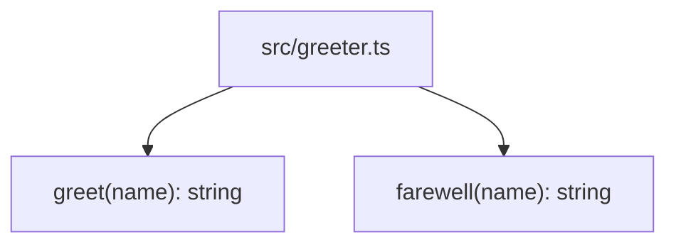

Per `README.md` and [[overview]] (`knowledge/overview.md`), this repo is a seeded testbed for a resolver+ingestion test matrix, not a running application. The entire working tree's code is one file, `src/greeter.ts`. There is no `package.json`, no build config, no entrypoint, no server process, and no `frontend/` source (only `frontend/AGENTS.md`, a guidance doc with no code alongside it) — so there are no services, processes, or cross-module imports to draw an architecture diagram around.

Both `greet` and `farewell` are standalone pure functions exported from the same module; neither calls the other, and no other file in the repo imports from `greeter.ts`, so the module currently has zero in-repo consumers.

## Divergences

Diverges from CLAUDE.md: the "Architecture" section describes Dapr pub/sub, PostgreSQL, a GraphQL gateway, and Kubernetes (AKS) deployment → none of that infrastructure exists in this working tree (no `nx.json`, no service directories, no Dockerfiles or k8s manifests, no dependency manifests of any kind). This mirrors the broader divergence already recorded in [[overview]].
