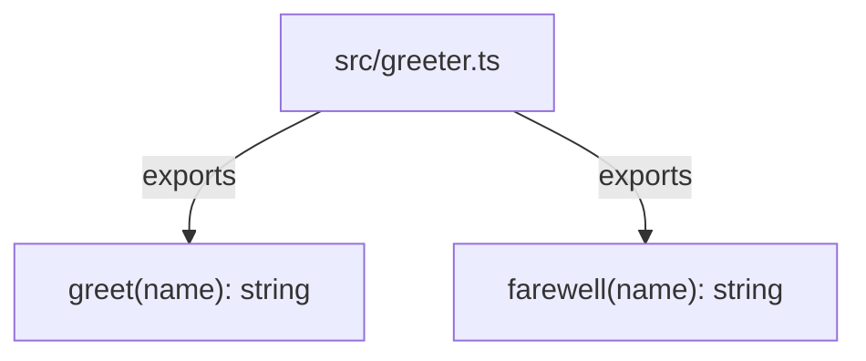

Per `README.md` this is a seeded testbed repo. The entire working tree has exactly one source file, `src/greeter.ts`, which exports two standalone functions and imports nothing. There is no `package.json`, no entrypoint, no HTTP/queue/DB wiring, and no other file in the tree imports from it — so there is no runtime call graph beyond the module itself.

Both exports are pure, self-contained string formatters with no shared state and no calls to each other.

## Diverges from CLAUDE.md

`CLAUDE.md` describes a large monorepo — Nx-orchestrated `jira/`/`monday/` service directories, .NET microservices behind Dapr pub/sub, a PostgreSQL store, and a GraphQL gateway. None of that exists in this working tree: no `nx.json`, no `jira/`/`monday/` paths, no `.csproj`/`.sln` files, no `package.json`. The actual architecture is the single leaf module shown above; treat `CLAUDE.md`'s architecture section as boilerplate carried over from an unrelated project (see also `[[overview]]`).
