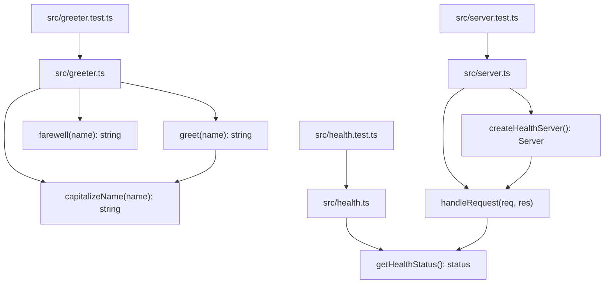

Per `README.md` and [[overview]] (`knowledge/overview.md`), this repo is a seeded testbed for a resolver+ingestion test matrix, not a running application — but it now contains two independent modules under `src/` instead of one. `src/greeter.ts` (name-formatting helpers) is unchanged. New this run: `src/health.ts` exports `getHealthStatus()` (returns `{ status: 'ok' }`), and `src/server.ts` builds on it — `handleRequest(req, res)` serves `GET /health` as a 200 JSON payload and 404s every other method/path, and `createHealthServer()` wraps it in a `node:http` server. `server.ts` also has a direct-execution guard (`import.meta.url === file://${process.argv[1]}`) that calls `.listen(process.env.PORT || 3000)` when run as the entrypoint — so there is now a real, if minimal, server process in this tree. There is still no `package.json`, no build config, and no `frontend/` source (only `frontend/AGENTS.md`, a guidance doc with no code alongside it) — the server has no dependency manifest, no start script, and must be invoked directly (e.g. via a TypeScript runner since there's no compiled JS).

`greet` still delegates to the extracted `capitalizeName` helper (both verb-first, per the naming rule in [[ingested-agents]] AGENTS.md); `handleRequest` and `createHealthServer` follow the same verb-first convention. `src/greeter.test.ts`, `src/health.test.ts`, and `src/server.test.ts` all use Node's built-in `node:test`/`node:assert` runner — `server.test.ts` listens on port `0` (OS-assigned) and drives real HTTP requests via `node:http`'s client rather than mocking `handleRequest`.

## Divergences

Diverges from CLAUDE.md: the "Architecture" section describes Dapr pub/sub, PostgreSQL, a GraphQL gateway, and Kubernetes (AKS) deployment → none of that infrastructure exists in this working tree (no `nx.json`, no service directories, no Dockerfiles or k8s manifests, no dependency manifests of any kind). The new `src/server.ts` is a bare `node:http` health endpoint, not a service in the CLAUDE.md sense. This mirrors the broader divergence already recorded in [[overview]].
