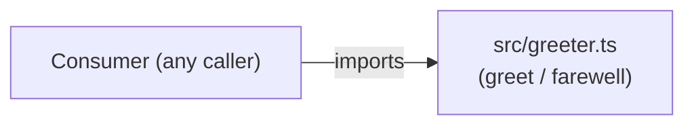

# Architecture

This repository is a minimal TypeScript library with a single module and no runtime services, databases, or external dependencies.

## Module: `src/greeter.ts`

The entire codebase is one file exporting two pure functions:

| Function | Signature | Behaviour |
|---|---|---|
| `greet` | `(name: string) → string` | Returns `"Hello, ${name}"` |
| `farewell` | `(name: string) → string` | Returns `"Goodbye, ${name}"` |

Both functions are stateless, synchronous, and have no side effects. There are no HTTP servers, queues, databases, or inter-service calls in this repo.
