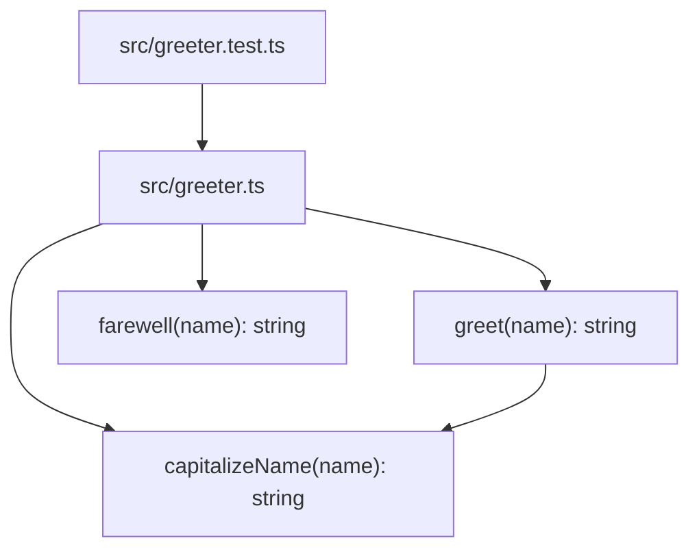

Per `README.md` and [[overview]] (`knowledge/overview.md`), this repo is a seeded testbed for a resolver+ingestion test matrix, not a running application. The working tree's source is one file, `src/greeter.ts`, plus a test file `src/greeter.test.ts` that imports from it. There is still no `package.json`, no build config, no entrypoint, no server process, and no `frontend/` source (only `frontend/AGENTS.md`, a guidance doc with no code alongside it) — so there are no services, processes, or multi-module architecture to diagram.

`greet` now delegates to the extracted `capitalizeName` helper (both verb-first, per the naming rule in [[ingested-agents]] AGENTS.md). `src/greeter.test.ts` is the first in-repo consumer of `greeter.ts`'s exports, using Node's built-in `node:test`/`node:assert` runner.

## Divergences

Diverges from CLAUDE.md: the "Architecture" section describes Dapr pub/sub, PostgreSQL, a GraphQL gateway, and Kubernetes (AKS) deployment → none of that infrastructure exists in this working tree (no `nx.json`, no service directories, no Dockerfiles or k8s manifests, no dependency manifests of any kind). This mirrors the broader divergence already recorded in [[overview]].
