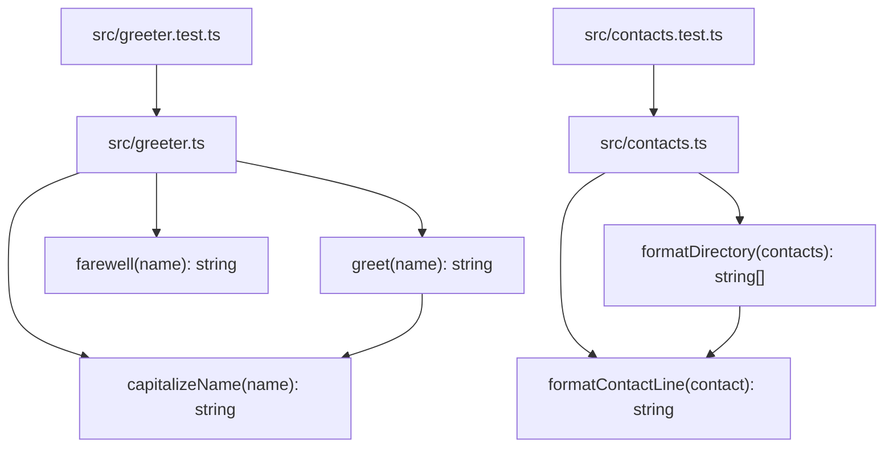

Per `README.md` and [[overview]] (`knowledge/overview.md`), this repo is a seeded testbed for a resolver+ingestion test matrix, not a running application. The working tree's source is two small, mutually-independent files under `src/` — `src/greeter.ts` and `src/contacts.ts` — each paired with its own test file. There is still no `package.json`, no build config, no entrypoint, no server process, and no `frontend/` source (only `frontend/AGENTS.md`, a guidance doc with no code alongside it) — so there are no services, processes, or multi-module architecture to diagram, just two standalone utility modules.

`greeter.ts` and `contacts.ts` share no imports or dependencies — they are separate, independently-testable utility modules that happen to live side by side in `src/`.

## Divergences

Diverges from CLAUDE.md: the "Architecture" section describes Dapr pub/sub, PostgreSQL, a GraphQL gateway, and Kubernetes (AKS) deployment → none of that infrastructure exists in this working tree (no `nx.json`, no service directories, no Dockerfiles or k8s manifests, no dependency manifests of any kind). This mirrors the broader divergence already recorded in [[overview]].
