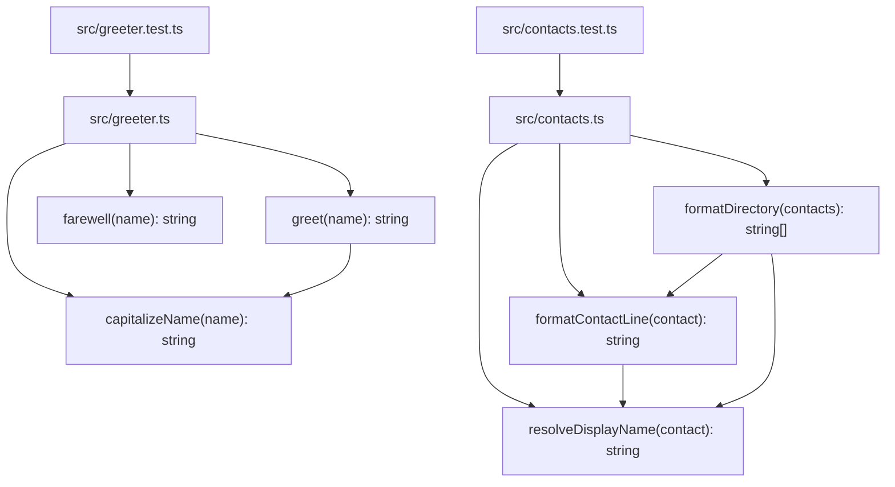

Per `README.md` and [[overview]] (`knowledge/overview.md`), this repo is a seeded testbed for a resolver+ingestion test matrix, not a running application. The working tree's source is now two independent files — `src/greeter.ts` (plus its test `src/greeter.test.ts`) and `src/contacts.ts` (plus its test `src/contacts.test.ts`) — with no imports between them. There is still no `package.json`, no build config, no entrypoint, no server process, and no `frontend/` source (only `frontend/AGENTS.md`, a guidance doc with no code alongside it) — so there are no services, processes, or multi-module runtime architecture, just two unrelated formatting/greeting modules.

`src/contacts.ts` is a second, unrelated module (contact-directory formatting) added alongside `greeter.ts`; the two share no code. `formatDirectory` sorts a copy of its input (does not mutate) and delegates display-name resolution to the internal, unexported `resolveDisplayName` helper.

## Divergences

Diverges from CLAUDE.md: the "Architecture" section describes Dapr pub/sub, PostgreSQL, a GraphQL gateway, and Kubernetes (AKS) deployment → none of that infrastructure exists in this working tree (no `nx.json`, no service directories, no Dockerfiles or k8s manifests, no dependency manifests of any kind). This mirrors the broader divergence already recorded in [[overview]].
